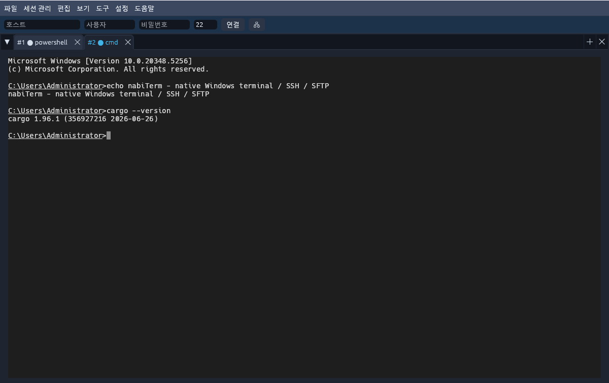

# 🦋 nabiTerm (나비텀)

**English** → [README.md](README.md)

**네이티브 Windows 터미널 멀티플렉서 + MobaXterm식 SSH 클라이언트** — Rust로 처음부터 만든 빠르고 가벼운 단일 실행 파일.

[](LICENSE)
[](https://github.com/matrixism-cmyk/NabiTerm/releases)
[](https://github.com/matrixism-cmyk/NabiTerm/actions)


> 📢 **2026-08-19 — nabiTerm이 오픈소스가 되었습니다!** 전체 소스가 Apache-2.0으로 이 저장소에 공개되어 있으며,
> 릴리스도 이곳에서 배포됩니다. 이슈·PR을 환영합니다 → [CONTRIBUTING.md](CONTRIBUTING.md)



---

## 소개

nabiTerm은 로컬 셸과 원격 서버를 하나의 창에서 다루기 위한 터미널입니다. 탭·분할·분리 창으로 여러 세션을 배치하고, SSH/SFTP/FTP로 원격에 접속하며, 파일 브라우저·내장 에디터·비밀번호 볼트까지 한 프로그램 안에 담았습니다. 외부 런타임이나 설치 의존성 없이 **단일 exe**로 동작하며, 자동 업데이트를 지원합니다.

### 다른 데서 못 보실 부분

pane 안에서 도는 AI CLI가 **나비텀 자신을 조작**합니다 — 창 목록을 읽고, 다른 창의
화면을 떠 가고, 셸을 띄우고, 명령을 보내고, 끝날 때까지 기다리고, SFTP로 파일을 옮깁니다.

```console
$ nabi cli list --json
[{"pane":1,"kind":"ssh","title":"web-01","state":"idle","cwd":"/srv/app"}]

$ nabi cli spawn --shell pwsh --dock split-down
pane 7
$ nabi cli send --pane 7 --data "cargo test"
$ nabi cli wait --pane 7 --idle 5
$ nabi cli capture --pane 7 --lines 12
test result: ok. 1601 passed; 0 failed
```

네트워크 포트를 열지 않습니다 — 윈도우 named pipe로만 통하고, 모든 동작은
**끔 / 물어봄 / 허용** 권한에 걸립니다(기본은 물어봄).

전통적인 터미널의 안정성(견고한 VT 코어·스크롤백) 위에, 최신 터미널 트렌드(명령 블록, 하이퍼링크, 인라인 이미지, 스타일드 밑줄)와 **AI 에이전트 제어 평면**을 더한 것이 특징입니다.

## 주요 기능

### 터미널 · 세션
- **탭 / 분할 / 분리 창** — egui_dock 기반 도킹, 탭을 창 밖으로 끌어 분리, tmux식 pane 줌
- **로컬 셸** — PowerShell·cmd 등(Windows ConPTY), 종료 시 실행 중이던 명령/디렉터리 복원
- **SSH / SFTP / FTP** — 순수 Rust(russh) 비동기 접속, 호스트키 TOFU 확인, 포트 포워딩(-L·-R·-D·ProxyJump·X11)
- **trzsz 파일 전송(`trz`/`tsz`)** — 셸 안에서 바로 파일을 주고받습니다. SFTP 채널을 따로
  열 수 없는 자리(점프 호스트·`sudo -i`·컨테이너 `exec`·시리얼 콘솔)를 위한 길입니다.
  전송은 매번 확인하고, 원격이 준 이름은 고쳐 쓰지 않고 거절합니다
- **멀티 실행(브로드캐스트)** — 여러 pane에 동시에 입력
- **검색 · 스크롤백** — 화면 내 찾기(스마트케이스), 우측 스크롤바, 프롬프트 점프
- **퀘이크 모드 · 전체화면 · 다국어(한/영/일) · 테마** — 8종 색 프리셋, 커서/선택 색 커스터마이즈

### 파일 · 편집
- **파일 브라우저** — 탐색기식 자세히/아이콘 보기, 드래그-아웃 복사, 내 컴퓨터/드라이브 용량, 로컬↔원격 이중창
- **내장 에디터(nabiPad)** — 구문 강조(syntect), 자동 인코딩 감지, HEX 편집, 대용량 파일 가상 뷰어, LSP 연동
- **비밀번호 볼트** — Argon2id + AES-256-GCM으로 SSH 자격증명 암호화 보관

### 최신 트렌드 기능
- **Warp식 명령 블록** — OSC 133 기반, 프롬프트 줄 좌측에 종료코드 색 막대(성공/실패)
- **하이퍼링크** — 휴리스틱 URL/경로 감지 + OSC 8 명시적 하이퍼링크, 길게 누르기 메뉴(복사/열기)
- **인라인 이미지** — Sixel · iTerm(OSC 1337) · Kitty(APC) 프로토콜 *(SSH 경로에서 동작; 로컬은 ConPTY 제약상 iTerm OSC만)*
- **스타일드 밑줄** — undercurl·이중·점선·파선 + 밑줄 색(SGR 58, nvim LSP 진단 등)

### AI 에이전트 통합
- **AI 명령 바** — claude/codex/gemini/aider 실행 pane 상단에 그 CLI의 슬래시 명령 버튼(하위 선택·설명 포함)
- **AI 터미널 프로필** — 셸+CLI+옵션(예: `--dangerously-skip-permissions`)을 프로필로 저장해 원클릭 실행
- **제어 평면** — pane 안의 프로세스가 `nabi cli`(named pipe) 또는 MCP로 nabiTerm을 제어(`list`·`spawn`·`send`·`capture`·`wait`·`notify` 등), 권한 정책 끔/물어봄/켬
- 도움말 ▸ AI 제어에서 AI CLI 설치 확인·관리, 사용 가이드 복사/저장

## 설치

[**Releases**](https://github.com/matrixism-cmyk/NabiTerm/releases)에서 받으세요.

- `nabiTerm-setup.exe` — 설치본(관리자 권한 불필요, per-user 설치)

여러 대에 배포하실 때는 설치본이 무인 스위치를 받습니다:

```powershell
nabiTerm-setup.exe /VERYSILENT /NOLAUNCH            # 설치만, 실행하지 않음
nabiTerm-setup.exe /VERYSILENT /ALLUSERS /NOLAUNCH  # 모든 사용자(관리자 권한 필요)
```

설치 후 **자동 업데이트**가 새 버전을 알리고 한 번에 적용합니다(도움말 ▸ 정보에서 수동 확인 가능).

> v0.1.446 이하에서 설치한 경우 자동 업데이트가 구 저장소([NabiTermPub](https://github.com/matrixism-cmyk/NabiTermPub/releases))를 확인합니다. **모든 릴리스를 양쪽에 게시하므로** 그대로 업데이트하시면 됩니다 — 새 저장소를 바라보는 버전으로 자연히 넘어옵니다.

### 소스 빌드

`BUILD.md`를 참고하세요 — MSVC 없이 GNU 툴체인(MinGW-w64)으로 빌드합니다. 요약: `rustup default stable-gnu` → MinGW-w64를 PATH에 추가 → `cargo build --release -p nabi-app`.

### GPU 없는 VM · 헤드리스 환경

nabiTerm은 GPU(wgpu: DX12→Vulkan→GL)로 그립니다. **GPU가 전혀 없는 VM·헤드리스 서버**에서는 시작 시 렌더 가능 여부를 자동 점검합니다:

- **인터넷 연결 시**: "GPU가 감지되지 않습니다. 소프트웨어 렌더링 구성요소(약 22MB)를 받을까요?" 확인창이 뜨고, 동의하면 자동으로 받아(무결성 SHA256 검증) `nabiTerm.exe` 옆에 설치한 뒤 소프트웨어로 실행합니다. 한 번 받으면 다음부터는 바로 실행됩니다.
- **오프라인(폐쇄망) 시**: 고정 [Mesa 런타임 자산](https://github.com/matrixism-cmyk/NabiTerm/releases/download/mesa-runtime/nabiTerm-mesa-software-gl.zip)(~22MB)을 받아 두 DLL을 `nabiTerm.exe` 옆에 직접 풀어 주세요.
- 환경변수 `NABI_RENDERER=software`로 소프트웨어 렌더를 강제, `NABI_RENDERER=hardware`로 자동 점검을 건너뛸 수 있습니다.

## 기술 스택

- **언어:** Rust (워크스페이스, 다수의 `nabi-*` 크레이트로 모듈화)
- **터미널 코어:** alacritty_terminal · **GUI:** egui / eframe (wgpu: DX12→Vulkan→GL, 소프트웨어 GL 폴백)
- **SSH/SFTP:** russh / russh-sftp · **로컬 PTY:** portable-pty(ConPTY)
- **플랫폼:** Windows 10 / 11 (x64)

## 라이선스 · 기여

nabiTerm은 **Apache License 2.0**으로 공개된 오픈소스입니다(루트 [`LICENSE`](LICENSE) · [`NOTICE`](NOTICE) 참조).

- **소스·릴리스**: <https://github.com/matrixism-cmyk/NabiTerm>
- **기여**: 이슈·PR 환영 — [`CONTRIBUTING.md`](CONTRIBUTING.md) (DCO sign-off) 참조
- **보안 취약점 신고**: [`SECURITY.md`](SECURITY.md)
- "nabiTerm/나비텀" 이름·로고는 별도 보호됩니다(Apache-2.0 §6 — 상표권 미포함).

사용한 오픈소스 구성요소와 각 라이선스는 앱 내 **도움말 ▸ 오픈소스** 탭과 [README.md](README.md#third-party-notices)에 정리되어 있습니다. `vendor/russh-sftp-2.3.0`은 SFTP 파일명 인코딩 지원을 위해 수정한 벤더 사본입니다(변경 내역은 `NOTICE`와 소스 주석에 고지).

---

<sub>🤖 nabiTerm 개발과 이 문서 작성에는 [Claude Code](https://claude.com/claude-code)의 도움을 받았습니다.</sub>
